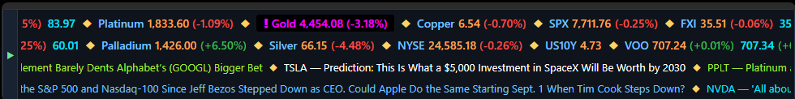
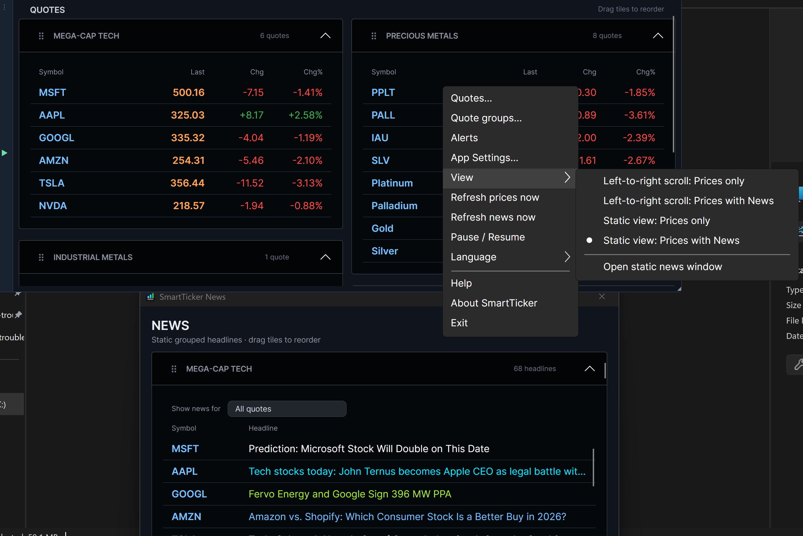
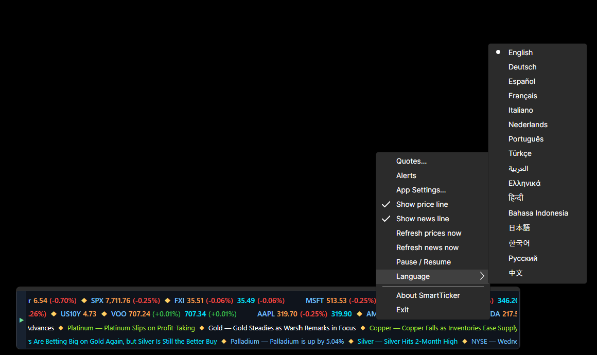
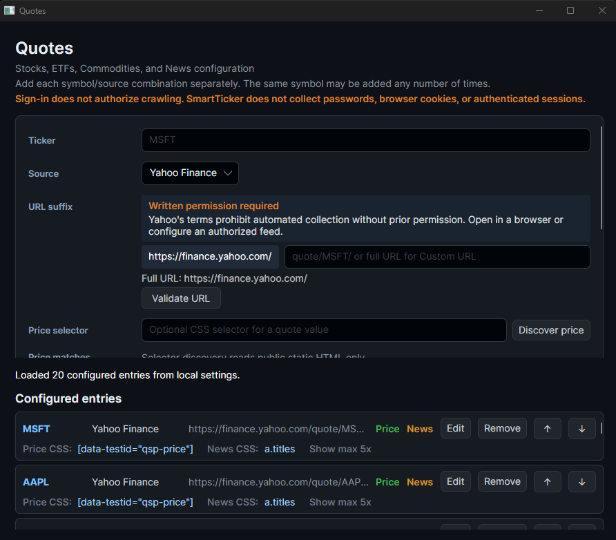
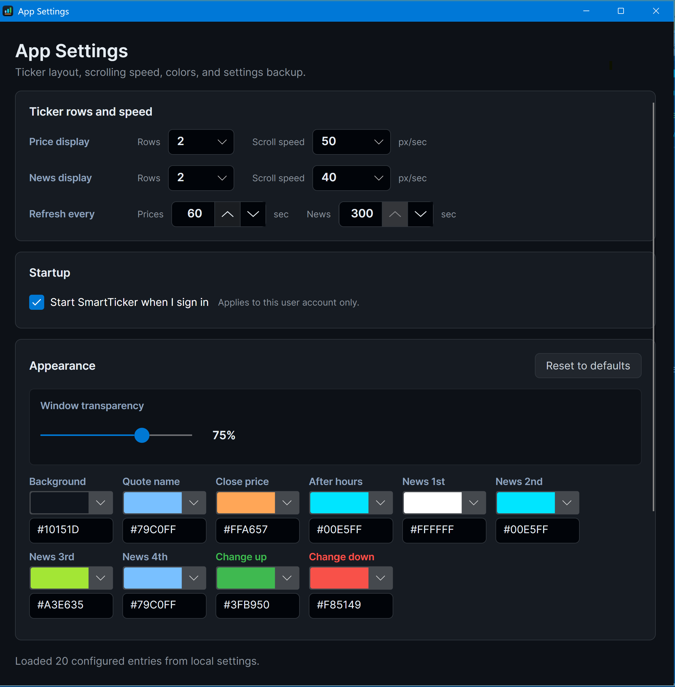
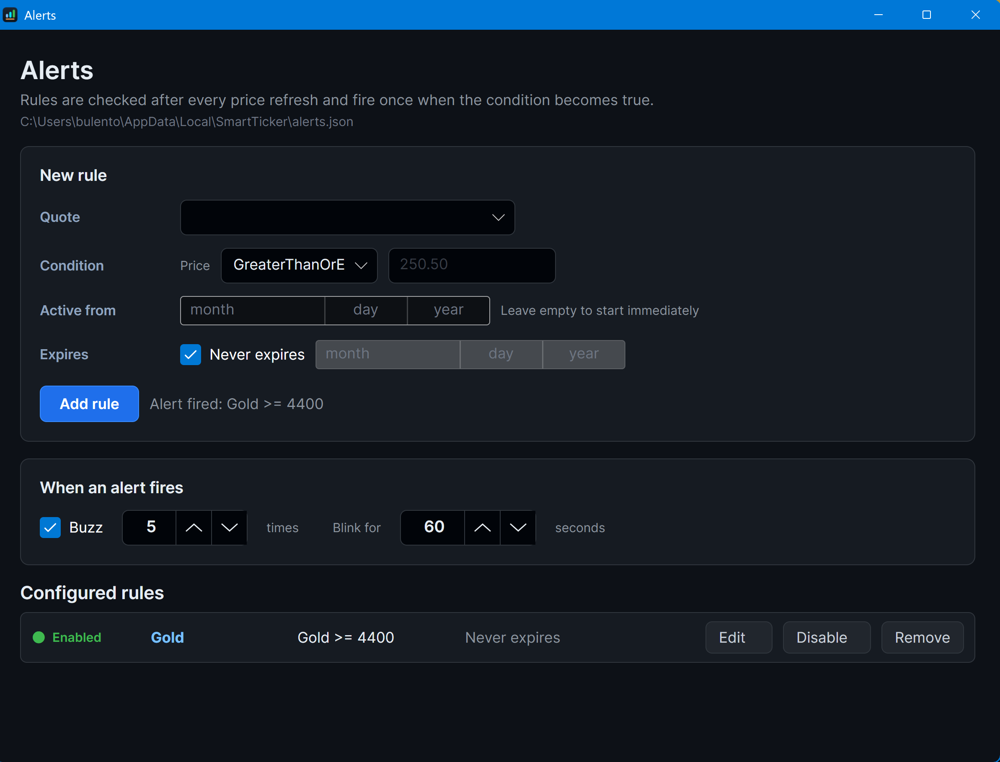
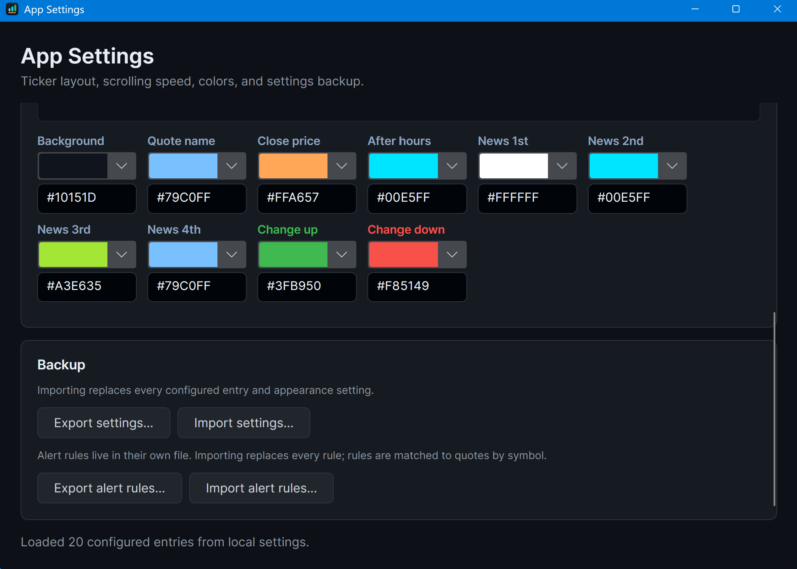

# SmartTicker


SmartTicker is a compact, always-on-top desktop ticker for prices and optional news headlines drawn from public web pages that you choose yourself. It starts with a scrolling Prices-only view and can switch to a two-line price-and-news marquee or separate static Prices and News views.

Unlike apps tied to a single data provider, SmartTicker lets you point each entry at any public page. Add a symbol, paste the page address, and SmartTicker reads the value from it. Stocks, ETFs, indices, commodities, currencies and crypto all work the same way, because you decide where each number comes from.

Built with C# on .NET 10 and Avalonia UI, so the Windows, Linux and macOS builds share the same portable application layers.

## Install from GitHub Releases

Open the [SmartTicker Releases](https://github.com/bulentozkir/smartticker/releases) page and expand **Assets** under the latest release. The packages are self-contained, so a separate .NET installation is not required.

**Windows**

- Most Windows PCs: download `SmartTicker-1.0.3-win-x64.msi`.
- Windows on ARM devices: download `SmartTicker-1.0.3-win-arm64.msi`.
- Run the downloaded MSI and follow the installer. The installer is currently unsigned, so Windows may display an unknown-publisher or SmartScreen warning.
- The `.msixbundle` is intended for Microsoft Store submission. Direct sideloading requires the bundle to be signed with a certificate trusted by the target computer.

After installation, open **SmartTicker** from the Start menu. Right-click the ticker to configure quotes, alerts and app settings.

**Debian and Ubuntu**

Download `smartticker_1.0.3_amd64.deb`, open a terminal in the download directory, and run:

```bash
sudo apt install ./smartticker_1.0.3_amd64.deb
```

Launch SmartTicker from the desktop application menu or by running `smartticker`. Only `amd64` Linux systems are currently packaged; no macOS package is available yet.

## Choose a ticker view

Right-click SmartTicker and open **View**. Four mutually exclusive choices are applied
immediately and remembered:

- **Left-to-right scroll: Prices only** shows only the price marquee and is the default.
- **Left-to-right scroll: Prices with News** shows both marquees.
- **Static view: Prices only** shows only responsive quote tiles.
- **Static view: Prices with News** shows quote tiles and opens a separate movable,
  resizable **SmartTicker News** window.

The News window starts compact and is placed on another monitor when available, or in
a non-overlapping position around Prices on a single monitor. Within every news group,
headlines are interleaved one per quote per round. The one-line **Show news for**
dropdown lets you show or hide each quote independently; those choices are saved in your
settings file and travel with a settings backup.

After every refresh, a quote whose price changed and any headline that is new since the
last sync blink on a brown background for three seconds.

To organize the static table, open **Quote groups...** from the right-click menu. Create,
update, or delete groups on the left; select a quote on the right; then use **Associate**
in the middle. Each quote belongs to at most one group, and re-associating it moves it
from the previous group. Deleting a group returns its quotes to **Ungrouped** without
deleting them. Settings export and import carry group definitions and assignments. The
published sample assigns all 28 entries to six example groups while keeping the scrolling
ticker selected by default.

In static mode, drag the dotted handle on any quote or news tile and drop it on the
left or right half of another tile. The saved order is shared by both windows. Tiles
fill the available width and pack under the shortest column, so no empty space is left
between groups. Every tile uses one column grid for its header and rows, so values stay
aligned as tiles resize. The Quotes and News windows can be placed on different monitors.
If News is closed, reopen it from **View > Open static news window**.

See [HELPME.md](HELPME.md) for the complete configuration guide, including selectors,
source validation, group ordering, backups, static-table behavior, and alert rules.

## Features

**Quotes and news**

- Always-on-top window with separate scrolling lines for prices and news
- Optional tiled static quote view with collapsible, user-defined groups and Last/Chg/Chg% columns
- Separate tiled static news window with cross-monitor placement and group ordering shared with quotes
- Four mutually exclusive price/news and scrolling/static combinations in the right-click **View** menu
- Round-robin static headlines with a one-line multi-select **Show news for** dropdown per group, saved with your settings
- Brown three-second highlight on any price that changed, and on every headline that is new since the last refresh
- Track any quote from a public web page you choose yourself
- Automatic value detection, or pick an exact element with a CSS selector
- After-hours prices and daily change percentages
- Clickable headlines that open in your browser
- Independent refresh intervals from 30 to 300 seconds, with both Price and News requests spread across their own one-second slots
- Separate 9–24 point font sizes for scrolling rows and static rows
- Separate persisted width/height settings for scrolling, static Prices, and static News windows
- Every window keeps its top-left drag/title corner at positive on-screen coordinates so it remains reachable

**Price alerts**

- Rules per quote using less than, greater than, equal to and other comparisons
- Optional start date, end date, or no expiry at all
- Flashing high-contrast highlight and an audible buzz when a rule fires, both for a duration you set
- Rules can be edited, disabled temporarily, or removed
- Stored in their own file, separate from the rest of your settings

**Appearance**

- One to eight rows per line, with adjustable scrolling speed
- Quote groups with explicit create, update, delete, associate, and ungroup actions
- Gapless static tiles that fill the available width and pack under the shortest column
- Adjustable window transparency
- Manual resizing updates the saved size for the active scrolling, static Prices, or static News view
- Configurable colours for the background, quote names, prices, after-hours values, rising and falling changes, alert blinking, and four separate news colours

**Everything else**

- Available in 16 languages, switchable from the right-click menu
- Optional automatic start when you sign in
- Export and import for both settings and alert rules
- One-click **Import Sample Quotes Config**, behind a confirmation that offers to export your current config first
- Advanced: open the live settings or alert-rules JSON in your text editor; a saved edit reloads immediately, and malformed JSON or a schema error is rejected with your current configuration kept
- No accounts, no sign-in, no cloud sync
- No telemetry, analytics or crash reporting; configuration is stored locally as ordinary JSON
- Advanced `SMARTTICKER_DATA_DIRECTORY` override for isolated diagnostic or test profiles
- Automatically starts at Low OS priority with Windows Efficiency mode enabled
- Formatted in-app Markdown help with a section navigator and offline fallback

See [PRIVACY.md](PRIVACY.md) for exactly what is stored and what leaves your computer.

## Screenshots

The ticker itself: two rows of prices above two rows of headlines. The highlighted quote is a fired price alert.



The static view: grouped quote tiles, the **View** menu with the four display modes, and the separate News window with its per-quote **Show news for** filter.



Everything is reachable from the right-click menu, including the language picker.



Quotes are added one symbol and source at a time, with optional CSS selectors and a discovery helper for finding the right element.



App Settings covers rows, scrolling speed, separate scrolling/static font sizes, three view-specific window sizes, refresh intervals, start at sign-in, window transparency and every colour.



Alert rules are created per quote, with an optional schedule, a buzz count and a blink duration.



Settings and alert rules can be exported and imported independently.



## Release 1.0.3

Available as an MSIX bundle and MSI installers for Windows (x64 and arm64), and a `.deb` for Debian-based Linux. See [releases](releases/README.md).

This release adds the four mutually exclusive display modes and makes scrolling Prices only the default, with a separate static News window, first-class quote groups, saved per-quote News filters, configurable alert colour, and three-second change highlights. Price and News requests are distributed across independent one-second slots instead of all starting together.

Desktop hardening contains recoverable refresh, event, persistence, and window-lifetime failures. A failed refresh retains the last successful price or headlines when available. On every Windows launch, SmartTicker sets its process priority to Low and enables Efficiency mode (EcoQoS) before starting the UI. Windows also uses a lower-overhead rendering path, the marquee adapts its timer cadence to scroll speed and stops it while paused or detached, and unchanged rows avoid redundant visual notifications. Brush and snapshot reuse further reduces routine allocation and lookup work.

Each web request has a 20-second timeout. SmartTicker surfaces HTTP failures such as 403 and 429 and does not bypass access restrictions, but it does not automatically parse or enforce robots directives, crawl-delay values, or server backoff instructions. Choose sources and refresh intervals that comply with each website's current policies. JavaScript-only pages and pages that prohibit automated access may not be supported.

For advanced diagnostics or isolated profiles, set `SMARTTICKER_DATA_DIRECTORY` before starting SmartTicker. Both `settings.json` and `alerts.json` are then read from and written directly to that directory instead of the platform default. This does not copy or import an existing profile; Settings export/import remains the normal backup workflow.

## Data and financial disclaimer

SmartTicker does not provide real-time market data, trading services, or investment advice. Extracted values can be delayed, stale, incomplete, or incorrect. Always verify financial information with an authoritative source before making a decision.

Users are responsible for ensuring that their use of each webpage or feed complies with its terms, licenses, robots directives, and applicable law.

## Repository layout

- [windows](windows/README.md) contains the application source, the tests, and the MSIX and MSI packaging. The Avalonia project here is shared, not Windows-only: the Linux build publishes the same project, so the folder name reflects the order the platforms were built rather than a split codebase.
- [linux-debian](linux-debian/README.md) holds the scripts that publish that project as `linux-x64` and pack it into a `.deb`.
- [macosx](macosx/README.md) is a placeholder. No macOS build exists yet.
- [releases](releases/README.md) is the local and CI output contract for generated packages.

## Development status

Windows is complete and packaged as MSIX and MSI for x64 and arm64. Debian-based Linux is packaged as an `amd64` `.deb`. macOS is not built. Build instructions are maintained in each platform directory.

## Ownership

Bulent Ozkir (bulentozkir@hotmail.com) is the patent and license owner.

No patent number, application status, or grant status is asserted by this notice.

## License

SmartTicker is available for non-commercial use under the PolyForm Noncommercial License 1.0.0. See [LICENSE](LICENSE) for the complete terms and [NOTICE.md](NOTICE.md) for the required ownership notice.

Commercial use is not permitted under this license. Contact the license owner to discuss separate commercial licensing.
